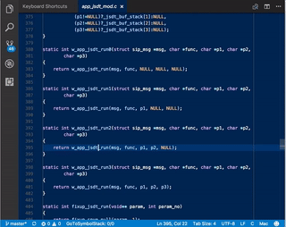

# GoTo-Symbol-Stack VSCode Extension

Extension for Visual Studio Code (VSCode) editor to jump to symbol (function, variable, ...) declaration, track the positions in a stack, navigate back and forth.

It is relying on the same function used natively by VSCode to jump to the symbol (the one with default key `F12`), but the native jump back (default `Cmd/Ctrl+-`) is tracking differently the positions (eg., storing when editing or when scrolling and making a short break), therefore this module provides an alternative, storing the positions only when jump to symbol is triggered.

The behaviour is somehow similar to jumping to `ctags` symbols in `Vim` editor and back to initial position (however, to make it clear, this extension does not require `ctags` at all).

## Features

The navigation operations are:

  * **jump to symbol** (go to declaration) - `Alt+]` - save current position on top of the stack and jump to symbol definition
  * **go to previous position** (down on stack) - `Alt+[` - jump to previous position saved in stack
  * **got to next position** (up on stack) - `Alt+Shift+]` - jump to next position save in stack

Note: for MacOS, use `Option` key instead of `Alt`.

A screenshot while jumping to declaration of symbols and back with this extension enabled:



### Navigation Notes

The position is saved on stack only when pressing `Alt+]`. It is not saving the position when being on top of the stack and pressing `Alt+[` (go back), so navigation forward (`Alt+Shift+]`) goes up to the position when last `Alt+]` was pressed, not to the postion where cursor jumped after pressing last `Alt+]`.

If there is no symbol at the position when `Alt+]` is pressed, the position is saved on top of the stack, so it can be used to keep track of other wanted placed in edited files.

## Requirements

Initial version has been developed using VSCode v1.11.2, but it should work for earlier versions.

## Extension Settings

Following VSCode commands and key bindings are exported by this extension.

```
    {
        "command": "extension.goto-symbol-stack.goToSymbolDeclaration",
        "key": "alt+]"
    },
    {
        "command": "extension.goto-symbol-stack.goPrevOnStack",
        "key": "alt+["
    },
    {
        "command": "extension.goto-symbol-stack.goNextOnStack",
        "key": "alt+shift+]"
    }
```

Key bindings can be changed via VSCode preferences.

## Installation

The extension is published on VSCode Marketplace at:

  * https://marketplace.visualstudio.com/items?itemName=miconda.goto-symbol-stack

To install it from the marketplace, launch VS Code Quick Open (`Cmd+P` or `⌘+P`), paste the following command, and press enter.

```
ext install goto-symbol-stack
```

To install from Git repository, clone it to your account VSCode folder (on MacOS or Linux, that is `~/.vscode/extensions`):

```
cd ~/.vscode/extensions
git clone https://github.com/miconda/vscode-goto-symbol-stack
```

The extension needs to be enabled from VSCode preferences.

## Known Issues

Tested only on MacOS on files with C code.

## ToDo

  * command to clear the positions stack
  * command to show details of the positions stored in the stack
  * ...

Contributions are welcome, use Github.com pull requests of the project:

  * https://github.com/miconda/vscode-goto-symbol-stack


## Copyright

Daniel-Constantin Mierla (asipto.com)

License: MIT

## Release Notes

### 1.0.1 (2017-04-24)

  * added a screencast to view usage of the module
  * disabled console log messages when jumping

### 1.0.0 (2017-04-23)

  * initial release

**Enjoy!**